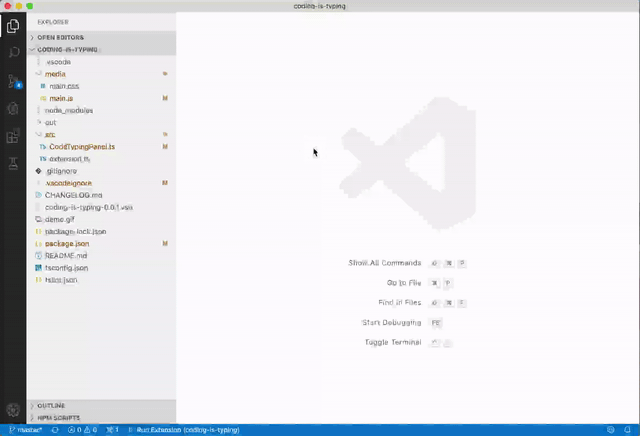

# Coding is typing

A vscode extension to help increasing the coding (or typing) speed.

## Install

### From marketplace

- Visit [here](https://marketplace.visualstudio.com/items?itemName=rhjiang.coding-is-typing) or search `Coding is typing` in vscode marketplace

### From VSIX

- Download the `coding-is-typing-*.vsix` package [here](https://github.com/killxin/coding-is-typing/releases)
- Open vscode extensions (shift + ctrl + x)
- Click `...` on the right corner of the side bar and select `install from VSIX...`
- Select the `coding-is-typing-*.vsix` package to install

## Usage

- Open a document as the active editor in vscode
- Press `F1` and select `Coding is typing: Enable codeTyping`
- Type to cover the red text
- Click `start`, `stop`, `reset` buttons to control the speed monitor

## Demo

## Build from source

- Open this example in VS Code 1.25+
- `npm install`
- `npm run watch` or `npm run compile`
- `F5` to start debugging

Run the `Coding is typing: Enable codeTyping` to create the webview.
