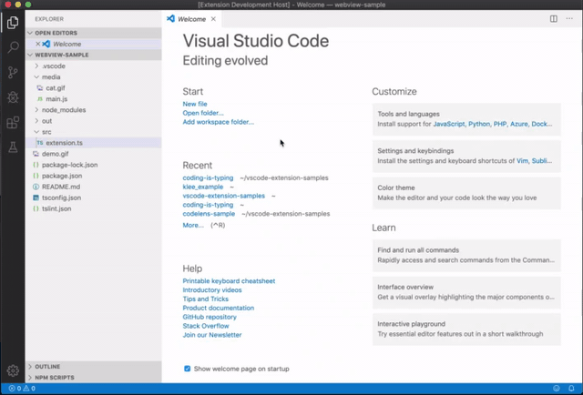

# Coding is typing

A vscode extension to help increasing the coding (or typing) speed.

## Usage

- Opening the document you want to type in vscode
- Entering `F1` and select `Coding is typing: Enable codeTyping`
- Typing to cover the red text
- Clicking `start`, `stop`, `reset` buttons to control the speed monitor

## Demo

## Setup

- Open this example in VS Code 1.25+
- `npm install`
- `npm run watch` or `npm run compile`
- `F5` to start debugging

Run the `Coding is typing: Enable codeTyping` to create the webview.
